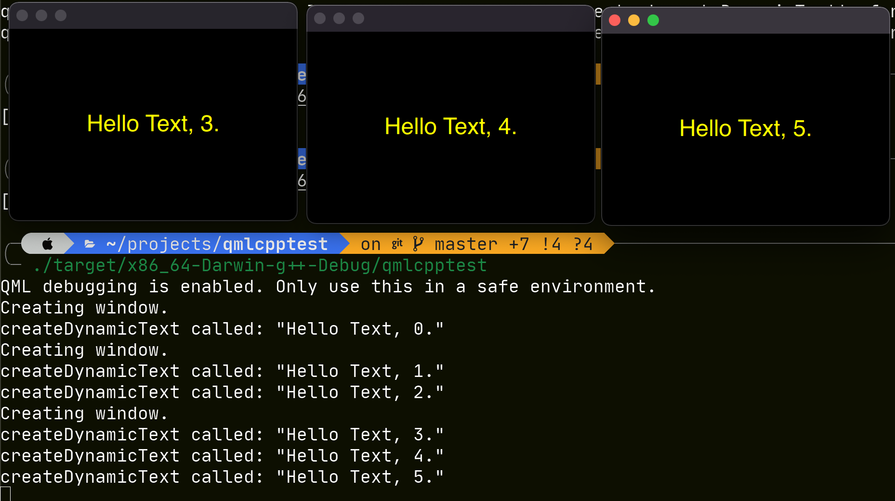

### QML/C++ interop Demo showcasing some bug or misunderstanding

This demo app spawns three windows, each should display a simple text line with an incrementing number.

1. First window: 1
2. Second window: 2
3. Third window: 3

However, the three windows show `3, 4, 5` instead of `1, 2, 3`. The screenshot shows 
running the app and the generated little debug prints along with it.

Turns out that for every `load()` call, QML engine seems to reinitialize all pre-existing root windows,
even though that has fatal concequences in my case at least. But how to work around this?

